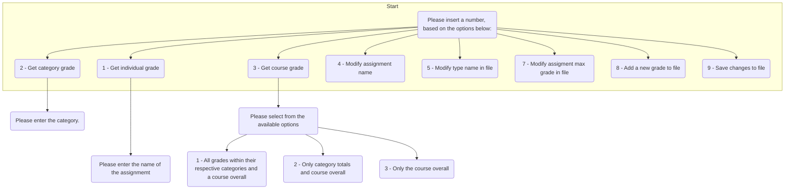

# Runtime Instructions:

Once the program has run, it will ask "Please insert a number, based on the options below:", in which 10 different options are given.

### The inputs of each option are case sensitive to the dataset for a .txt file

 

### Entering a 1, will allow the user to get a specific grade of any assignment, lab, project, or final exam.

* However, entering an input not within the text file will result in a message that says:

--------------------------------------------------------
*Error: Assignment name not in gradebook*

 

### Entering a 2, will allow the user to search for a category grade.
In which it will output all of the assignments in that category, their grades, and the category grade.

--------------------------------------------------------
Name of Assignment: 

Grade: 

 

#### Entering a 3, will give an output to the course grade, which includes 3 different options.

*The first option is all the grades in the respective categories, the category grades, and the course overall grade.

*The second option will output all the category grades and the course overall grade.

*The third option will output only the course overall grade

 

### Options 4 to 8 are changes done directly to the file, but will not be saved unless option 9 for saving changes is inputted by the user

 

#### Entering a 4, will the user to change the name of an assignment name

*This is done by entering the original assignment name first and a whitespace between the new desired name to replace the original name.

 

#### Entering a 5, will the user to change the name of a specific assignment to a different category type

*This is done by entering the assignment name first and a whitespace between the new category to place the assignment in.

 

#### Entering a 6, will the user to change the grade of a specific assignment

*This is done by entering the assignment name first and a whitespace between the grade to give the assignment

 

#### Entering a 7, will the user to change the max score grade of a specific assignment

*This is done by entering the assignment name first and a whitespace between the max score grade to give the assignment

 

#### Entering a 8, allows the user to add an entire new assignment with a category, grade obtained, and a max grade.

*This is done by entering the new assignment name, category, grade obtained, and max grade.

*ALL WITH WHITE SPACE BETWEEN AND NO COMMAS IN BETWEEN*

 

#### Entering a 9 will save all changes desired from inputs to the original file

 

### Entering a 0 will completely exit out the program, leaving any progress not saved from input 9 to be gone.
